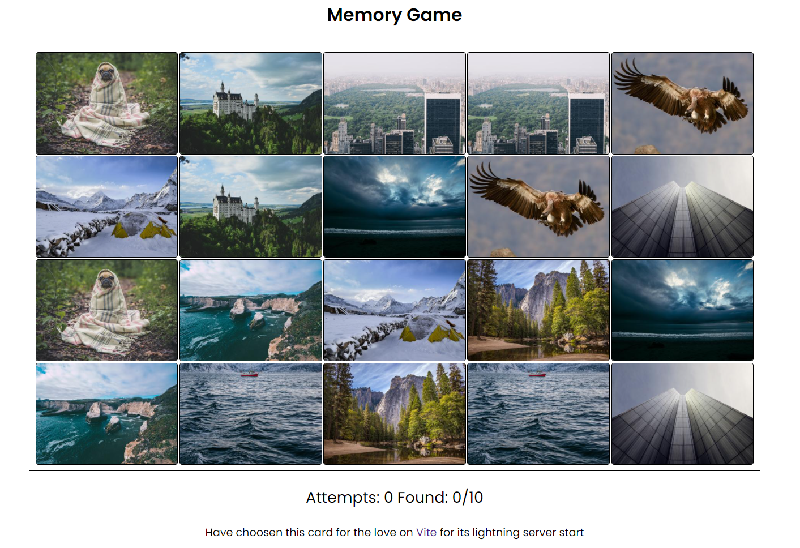

---
<br />
<div align="center">
  <h3 align="center">Memory game</h3>

  <p align="center">
    Card Memory game which we used to play in childhood!
    <br />
    <br />
  </p>
</div>

### Built Using

* Html, CSS, JS, Vite server

<!-- GETTING STARTED -->
## Getting Started

### Installation

1. Clone the repo
   ```sh
   git clone https://github.com/VishwanathDalawai/Memory-Game.git
   ```
2. Install dependencies
   ```sh
   npm i
   ```
3. Run dev server
   ```sh
   npm run dev
   ```

<p align="right">(<a href="#top">back to top</a>)</p>

## Thank you

Feel free to use this template!

Star to the repo helps :)

Available on  at [VishwanathDalawai](https://www.linkedin.com/in/vishwanath-dalawai/)
